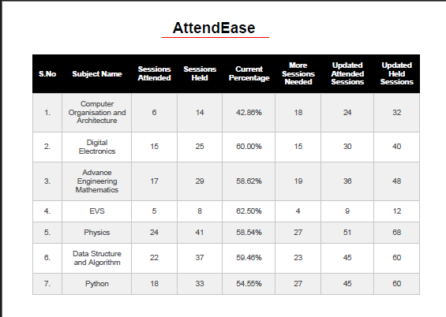

# AttendEase

## 📸 Screenshot

## 📌 Overview
**AttendEase** is a student-centric tool designed to help students effortlessly track their attendance percentage. It allows users to:
- Check their **current attendance percentage**.
- Calculate **the number of classes required** to reach the mandatory **75%** threshold.

Built by students, for students, AttendEase eliminates the guesswork and ensures you stay on top of your attendance requirements!

## 🚀 Features
- **Real-time Attendance Tracking**: View your current attendance percentage.
- **Class Requirement Calculator**: Determine how many more classes you need to attend to reach 75%.
- **User-friendly Interface**: Simple, minimalistic, and intuitive design for seamless usage.
- **Mobile & Desktop Friendly**: Accessible on multiple devices.

## 🔧 How to Use
1. Enter the **total number of classes conducted**.
2. Enter the **number of classes you have attended**.
3. Click on **Calculate**.
4. Get your **attendance percentage** and the **number of classes required** to reach 75%.

---
Stay on top of your attendance with **AttendEase**! 🎯

